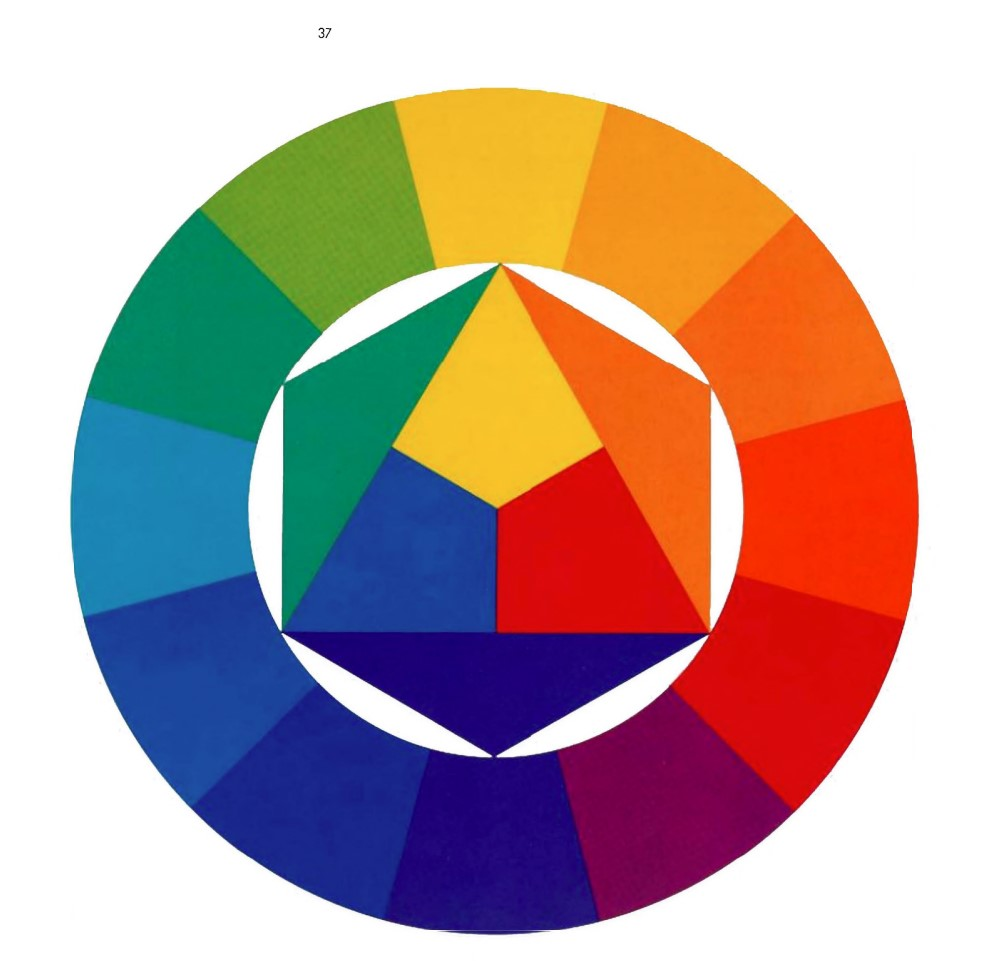

### THE ART OF COLOR 

The subjective experience and objective rationale of color 

Translated by Ernst van Haagen 

VAN NOSTRAND REINHOLD COMPANY 

Van Nostrand Reinhold Company, 

Regional Offices: 
New York, Cincinnati, Chicago, Millbrae, Dallas 

Van Nostrand Reinhold Company International Offices: 
London, Toronto, Melbourne 

This book was originally published in Germany under the title , Kunst der Farbe” copyright © 1961 and 1973 by Otto Maier Verlag Ravensburg, Germany Library of Congress Catalog Card Number 61-11190 ISBN 0-442-24037-6 

Color separation: Seiler & Jehle, Augsburg 

Composition: Buch- und Verlagsdruckerei Goppel, Ravensburg 

Printing: J. Fink, Kemnat near Stuttgart 

Published in the United States of America by Van Nostrand Reinhold Company A Division of Litton Educational Publishing, Inc. 450 West 33rd Street, New York, N.Y. 10001

#### ACKNOWLEDGMENT  

When the plans for this book were at the stage  of discussion between Mr. Peter Maier and myself, he already fully appreciated the technical  difficulties involved in so ambitious an undertaking.  As a result of his courageous decision, the  publishers have worked indefatigably to make my  experience of color available to a larger audience  beyond the classroom. I am  grateful to the  publishing house of Otto Maier for their faith in  my project and for their splendid cooperation.  Members of the staff were consistently helpful in  dealing skillfully with the many problems that  arose.   The Graphische Anstalt E. Wartelsteiner, of  Munich, has devoted the most painstaking attention  to color fidelity in the reproduction of the  illustrations.   Mrs. Lucia Moholy has been of valuable aid to  me in the editing of the manuscript.   This book could never have been completed  without the unfailing assistance and encouragement  of my wife.  
Zurich, February 18, 1961. 
Johannes Itten. 

*) The reproductions for the new 1973 edition were 
made by Seiler & Jehle, Augsburg.

#### To the new 1973 edition 

When preparing the first edition of “The Art of Color” in 1960, author and publisher faced the difficult problem of finding the best way of reproducing the color. This could only be achieved by producing the various color illustrations and tables in  different printing processes done by several printers - partly with special colors - and tipping them in the book. In 1970, when the students’ edition was planned, this complicated method of production could not be retained. Thanks to advanced technology, the printing quality of the students’ edition was in many  ways an improvement over the large edition. Thus, a standard was set for a new large edition. For the present new printing, the entire production was  adapted for offset. The reproduction of all the illustrations was done  by Seiler & Jehle, Augsburg, without whose valuab le collaboration the book could not have appeared  in its present form. We gratefully acknowledge here  this accomplishment, as well as the excellent printing by J. Fink, StuttgartKemnat. All together, care was taken to leave the work un touched. Contents and sequence of pages have  been retained, some of the illustrations enlarged  and improved according to existing copies. The aim  of the new edition is to make Johannes Itten’s color  theory available again, improved and strictly adhering to his principles of presentation. 

Zurich, April 1973 
Anneliese /tten 

#### CONTENTS 

* Introduction  
* Color Physics  
* Color Agent and Color Effect  
* Concord of Colors  
* Subjective Timbre  
* Theory of Color Design  
* The 12-hue Color Circle  
* The Seven Color Contrasts  
* Hue  
* Light-Dark  
* Cold-Warm  
* Complementary  
* Simultaneous  
* Saturation  
* Extension  
* Color Mixing  
* Color Sphere and Color Star  
* Color Harmony and Variations  
* Form and Color 
* Spatial Effect of Colors 
* Theory of Color Impression 
* Theory of Color Expression 
* Composition 
* Postscript 
* Sources 

#### LIST OF PLATES 

* “Apocalypse de Saint Sever” - L'Eglise d’Ephése  
* Enguerrand Charonton - Coronation of the Virgin  
* Paul de Limbourg - May-Day Excursion  
* Piet Mondrian - Composition 1928  
* Francisco de Zurbardn - Lemons, Oranges and Rose  
* Rembrandt - Man in Golden Helmet  
* Pablo Picasso - Guitar on Mantelpiece  
* Stained glass window, Chartres - Virgin and Child  
* Mathias Grinewald - Angel Choir (detail)  
* Auguste Renoir - Le Moulin de la Galette (detail)  
* Claude Monet - Houses of Parliament in Fog   
* Paul Cézanne - Apples and Oranges  
* Jan van Eyck - Madonna of the Chancellor Rolin  
* Piero della Francesca - Solomon Receiving the Queen of Sheba  
* Paul Cézanne -  La Montagne Ste.-Victoire  
* “Apocalypse de Saint Sever” - Satan and the Locusts   
* El Greco - Stripping of Christ  
* Vincent van Gogh - Café at Evening  
* Georges de la Tour - Newborn Babe   
* Henri Matisse - Le Piano 
* Paul Klee - Magic Fish  
* Pieter Bruegel the Elder - Landscape with Fall of Icarus  
* Georges Seurat - Un Dimanche a Grande Jatte (preliminary study)  
* Dominique Ingres - Reclining Odalisque  
* Konrad Witz - The Synagogue  
* Pieter Bruegel the Elder - Parable of the Blind Men  
* Mathias Griinewald - Resurrection and Transfiguration  
* Neroccio di Bartolommeo - Sermon of St. Bernard   

#### INTRODUCTION 

Learning from books and teachers is like traveling by carriage, so we are told in the Veda. The thought goes on, “But the carriage will serve only while one is on the highroad. He who reaches the end of the highroad will leave the carriage and walk afoot.” 

In this book I shall try to build a serviceable conveyance that will help all who are interested in the problems of color artistry. One may travel carriageless and by unblazed trails, but progress is then slow and the journey perilous. If a high and distant goal is to be attained, then it is advisable to take a carriage at first in order to advance swiftly and safely. 

Many of my students have helped me to find materials with which to build, and I am deeply indebted to them. The doctrine to be developed here is an aesthetic color theory originating in the experience and intuition of a painter. For the artist, effects are decisive, rather than agents as studied by physics and chemistry. Because color effects are in the eye of the beholder, the many color plates were indispensable. Yet the deepest and truest secrets of color effect are, I know, invisible even to the eye, and are beheld by the heart alone. The essential eludes conceptual formulation. 

In the realm of aesthetics, are there general rules and laws of color for the artist, or is the aesthetic appreciation of colors governed solely by subjective Opinion? Students often ask this question, and my answer is always the same: “If you, unknowing, are able to create masterpieces in color, then un-knowledge is your way. But if you are unable to create masterpieces in color out of your unknowledge, then you ought to look for knowledge.” 

Doctrines and theories are best for weaker moments. In moments of strength, problems are solved intuitively, as if of themselves. 

Close study of the great master colorists has firmly convinced me that all of them possessed a science of color. For me, the theories of Goethe, Runge, Bezold, Chevreul and Hélzel have been invaluable. 

I hope to be able to resolve a great many color problems in this book. We are not merely to expound objective principles and rules, but also to explore and survey the subjective predicament, as it pertains to critical taste in the realm of color. 

We can be released from subjective bondage only through knowledge and awareness of objective principles. 

In music, the theory of composition has long been an important and accepted part of a professional education. However, a musician may know counterpoint and still be a dull composer, if he lacks insight and inspiration. Just so, a painter may know all the resources of composition in form and color, yet remain sterile if inspiration be denied him. 

It has been said that genius is 99 per cent perspiration and I per cent inspiration. There was a debate in the press years ago between Richard Strauss and Hans Pfitzner about the relative shares of inspiration and contrapuntal deduction in the process of composition. Strauss wrote that four to six bars were inspiration in his own works, and the rest elaboration. Pfitzner replied, “It may well be that Strauss is inspired only through four to six bars, but I have noticed that Mozart often composes many pages together under inspiration.” 

Leonardo, Direr, Grinewald, El Greco and the rest did not scorn to examine their artistic media intellectually. How could the Isenheim altarpiece have been produced, had not its creator pondered form and color? 

Knowledge of the laws of design need not imprison, it can liberate from indecision and vacillating perception. What we call laws of color, obviously, can be no more than fragmentary, given the complexity and irrationality of color effects. 

In the course of time, the human mind has penetrated many mysteries in their essence or in their mechanism - the rainbow, thunder and lightning, gravity and so on. But they are still mysteries for all that. 

Delacroix wrote, “The elements of color theory have been neither analyzed nor taught in our schools of art, because in France it is considered superfluous to study the laws of color, according to the saying ‘Draftsmen may be made, but colorists are born.’ Secrets of color theory? Why call those principles secrets which all artists must know and all should have been taught?” (Les Artistes de mon Temps). 

As the tortoise draws its limbs into its shell at need, so the artist reserves his scientific principles when working intuitively. But would it be better for the tortoise to have no legs? 

Color is life; for a world without colors appears to us as dead. Colors are primordial ideas, children of the aboriginal colorless light and its counterpart, colorless darkness. As flame begets light, so light engenders colors. Colors are the children of light, and light is their mother. Light, that first phenomenon of the world, reveals to us the spirit and living soul of the world through colors. 

Nothing affects the human mind more dramatically than the apparition of a gigantic color corona in the heavens. Thunder and lightning frighten us; but the colors of the rainbow and the northern lights soothe and elevate the soul. The rainbow is accounted a symbol of peace. 

The word and its sound, form and its color, are vessels of a transcendental essence that we dimly surmise. As sound lends sparkling color to the spoken word, so color lends psychically resolved tone to form. 

The primeval essence of color is a phantas- magorical resonance, light become music. At the moment when thought, concept, formulation, touch upon color, its spell is broken, and we hold in our hands a corpse. 

In the tinted monuments of past ages, we can trace the emotional dispositions of vanished peoples. The ancient Egyptians and Greeks greatly delighted in varicolored design. 

The Chinese were accomplished painters from early times. An emperor of the Han dynasty is recorded in 80 B.C. to have kept storehouses — a museum — of paintings collected by him, said to have been of great and colorful beauty. In the T'ang period (618-907 A.D), there arose a strongly colored mural and panel painting. About the same time, new yellow, red, green and blue ceramic glazes were developed. In the Sung dynasty (960-1279 A.D.), the sense of color was extraordinarily cultivated. Pictorial colors became more varied and at once more naturalistic. Ceramics evolved many new glazes of matchless beauty, such as celadon and clair de lune. 

Strongly colored Roman and Byzantine polychrome mosaics from the first millennium of the Christian era have been preserved in Europe. Mosaic art placed high demands on coloristic powers, because each color area is composed of numerous point elements, each requiring consideration and choice. The mosaic artists of Ravenna in the fifth and sixth centuries were able to produce many different effects with complementary colors. 

The mausoleum of Galla Placidia is dominated by a remarkable colored atmosphere of gray light. This effect is produced by bathing the blue mosaic walls of the interior in an orange light, filtered through narrow windows of orange-tinted alabaster. Orange and blue are complementary colors, the mixing of which yields gray. As the visitor moves about the shrine, he receives different quantities of light which is alternately accented blue and orange, the walls reflecting these colors at ever-changing angles. This interplay gives an impression of suffusion with color. 

In the early medieval illuminations of the Irish monks in the eighth and ninth centuries, we find a palette of great variety and subtlety. Most astonishing in their radiant power are those pages where the many different colors are rendered in equal brilliance. The resulting vivid cold-warm effects are such as we do not find again until the Impressionists and Van Gogh. Some leaves of the Book of Kells, for logic of chromatic execution and organic rhythm of line, are as magnificent and pure as a Bach fugue. The sensitivity and artistic intelligence of these “abstract” miniaturists had their monumental counterpart in the stained glass of the Middle Ages. Early stained glass employed only a few different colors, and therefore seems crude, for glassmaking techniques afforded few colors as yet. Anyone who has spent a day studying the windows in the cathedral at Chartres in the changing light, and has seen the setting sun kindle the great rose window to a splendid culminating chord, will never forget the supernal beauty of that moment. 

The Romanesque and Early Gothic artists, in their mural and tablet paintings, used colors as symbolic expressions. Therefore they endeavored to produce unequivocal, unclouded tones. Simple and clear symbolic effect was sought, rather than multitudinous shadings and chromatic variations. Form received a similar treatment. 

Giotto and the Sienese school may have been the first painters to indivualize the human figure in form and color, thus initiating a development that was to lead to the imposing throng of artist personalities encountered in the Europe of the fifteenth, sixteenth and seventeenth centuries. 

In the first half of the fifteenth century, the brothers Hubert and Jan van Eyck began to construct patterns of composition around the local colors of the person or thing represented. These local colors, through dull and bright, light and dark tones, produced realistic images very closely approaching nature. Color became a means of characterizing natural objects. The Ghent altarpiece was finished in 1432, and in 1434 Jan van Eyck executed the first Gothic portrait, the double portrait of Arnolfini and his lady. 

Francesca (1410-1492) painted individuals in sharp outline and clearly expressive areas, with balancing complementary colors. The hues are rare tones especially characteristic of the artist. 

Leonardo (1452-1519) rejected strong coloration. He painted in infinitesimal tonal gradations, organized in the case of his “Virgin of the Grotto” into two principal planes. “St. Jerome” and the “Adoration” are composed entirely in sepia tones of light and shade. 

Titian (1477 - 1576) in his early work set homogeneous color areas against each other in isolation. Later, he progressively resolved such areas into cool and warm, light and dark, dull and intense modulations, perhaps best exemplified by the “Bella”, in the Pitti galleries. In the works of his old age, he evolved objects out of one principal hue and many variant tints and shades. The “Ecce Homo” is an example.
 
Fl Greco (1545 - 1614) was a pupil of Titian. He brought his master’s polytonality back to large, expressive color areas. His strange, frequently shocking color renditions cease to represent local colors, but are abstract, matching the psychically expressive requirements of the theme. This is why El Greco is considered a progenitor of nonobjective painting. His color areas do not denote objective categories. They have been organized into sheer pictorial polyphony. 

Grinewald (1475 - 1528), a century earlier, had solved this same problem. Where El Greco’s shades are always sharply and characteristically defined by gray and black tones, Grinewald set color against color. Through what may be called an objective mastery of the universe of color, he discovered the appropriate colors for each pictorial motif. The Isenheim altarpiece in all its parts shows such multiplicity of color quality, effect and expression as to be properly called an intellectually universal color composition. The Annunciation, Angel Choir (Plate IX), Crucifixion, Resurrection (Plate XXVII), are pictures utterly different from each other, in form as well as color. 

In fact, Grinewald sacrificed decorative unity of the altarpiece as a whole to artistic truth of the individual theme. He set himself above the scholastic canon, in order to be truthful and objective. However, the psychologically expressive power of his colors, their symbolic verity, and their realistic signification — all these three potentialities of color are, in a deeper sense, fused into unity. 

Rembrandt (1606 - 1669) is considered the exemplar of chiaroscuro painters. Though Leonardo, Titian and Ej Greco used chiaroscuro as a means of expression, Rembrandt's work is altogether different. He felt color as a dense material. With gray and blue or yellow and red transparent tones, he created an effect of depth that has a remarkably transfigured life of its own. Employing a mixed paste of tempera and oil paints, he achieved textures radiating an uncommonly affecting realism (Plate VI, Man in Golden Helmet). In Rembrandt, color becomes materialized light-energy, charged with tension. Pure colors often shine like jewels in dull settings.  
    &nbsp;&nbsp;&nbsp;&nbsp;El Greco and Rembrandt carry us into the problems of baroque color. In the more extreme baroque architectures, static space is resolved into space with dynamic rhythm. Color is enlisted in the same service. It is detached from its objective denotation and becomes an abstract means of rhythmic articulation. Ultimately, it is used to assist depth illusions. The work of the Viennese painter Maulbertsch (1724 - 1796) exhibits such characteristically baroque coloration. 

In the art of the Empire and Classical periods, coloration is confined to black, white, gray, sparingly enlivened with some few chromatic colors. This style, giving an effect of realism and sobriety, was supplanted by Romanticism. The beginning of the Romantic movement in painting is identified with Turner (1775 - 1851) and Constable (1776 - 1837) in England. Its greatest exponents in Germany were Caspar David Friedrich (1774-1840) and Philipp Otto Runge (1777 - 1810). These painters employed color as a psychico-expressive medium, to lend “mood” to landscape. Constable, for example, would not apply homogeneous green to canvas, but would resolve it into minute gradations of light and dark, cold and warm, dull and vivid tones. Color areas were thus rendered subtly vital. Turner produced some non-objective color compositions that would warrant listing him as the first “abstractionist” among European painters. 
    &nbsp;&nbsp;&nbsp;&nbsp;Delacroix (1798 - 1863) saw Turner’s and Constable’s work when he was in London. Their colorism interested him deeply, and on his return, he re-did some paintings of his own in the same spirit, thereby causing a sensation at the 1820 Salon de Paris. Delacroix was actively concerned with color problems and principles throughout his lifetime. 

General interest in the influence and rationale of color prevailed early in the nineteenth century. Runge published his color theory using the sphere as a coordinate system in 1810. Goethe's major work on color appeared likewise in 1810, and in 1816 Schopenhaver published his treatise “On Vision and Colors.” The chemist M. E. Chevreul (1786 - 1889), manager of the Gobelin works in Paris, published his “De la Loi du Contraste Simultané des Couleurs et de l’Assortiment des Objets Coloris” in 1839. This work was to become the scientific foundation of Impressionist and Neo-Impressionist painting. 

Intensive study of nature led the Impressionists to an entirely new color rendition. Study of sunlight, which alters the local tones of natural objects, and study of light in the atmospheric world of landscape, provided the Impressionist painters with new essential patterns. Monet explored these phenomena conscientiously, requiring a fresh canvas to represent a landscape at each hour of the day, so that the progress of the sun and resulting change in color of the light and reflections might be truly rendered. The best demonstration of this procedure are his cathedral paintings, on display in the Jeu de Paume Museum in Paris. 

The Neo-Impressionists divided color areas into point elements. They affirmed that mixing pigments breaks the power of the colors. The dots of pure color were to become mingled only in the eye of the viewer. 
    &nbsp;&nbsp;&nbsp;&nbsp;The color theories of Chevreul were of signal aid to the Impressionists. 

Proceeding from Impressionist ideas, Cézanne arrived at a logically developed color construction. It was his task to fashion Impressionism into something “substantial”; his pictures were to stand upon formal and chromatic principle. Apart from his rhythmic and formal contributions, in color he rejected the Pointillist technique of division, returning to continuous areas modulated internally. To him, modulating a color meant varying it between cold and warm, light and dark, or dull and intense. Such modulation throughout the picture area accomplished new, vivid harmonies. 
    &nbsp;&nbsp;&nbsp;&nbsp;Titian and Rembrandt had contented themselves with color modulations of faces and figures; Cézanne was now integrating the whole picture formally, rhythmically and chromatically. In the still life “Apples and Oranges” (Plate XII), this new integration is clearly apparent. Cézanne wished to remold nature at a higher level. To do this, he employed the cold-warm contrast with musical, ethereal effect. Cézanne, and Bonnard after him, composed some pictures entirely on the cold-warm theme. 

Matisse refrained from modulation, to again express simple, luminous areas in subjective equilibrium. With Braque, Derain and Vlaminck, he belonged to the Paris group Les Fauves. 

The Cubists — Picasso, Braque and Gris — used colors for their light-dark values. They were primarily interested in form. They analyzed the shapes of objects into abstract geometric forms, obtaining relief-like effects by tonal gradation. 

The Expressionists — Munch, Kirchner, Heckel, Nolde, and the Blauer Reiter painters Kandinsky, Marc, Macke, Klee — were attempting to restore psychological content to painting. Their creative aim was to represent internalized and spiritualized experience by means of shapes and colors.  
    &nbsp;&nbsp;&nbsp;&nbsp;Kandinsky began painting non-objective pictures about 1908. He contended that every color has its proper expressional value, and that it is therefore possible to create meaningful realities without representing objects. 

Adolf Hélzel became the center of a group of young painters in Stuttgart who attended his lectures on color theory, based on the discoveries of Goethe, Schopenhauer and Bezold. 
    &nbsp;&nbsp;&nbsp;&nbsp;Between 1912 and 1917, in various parts of Europe independently, artists were at work producing what may be subsumed under the collective name “art concret”. Among them were Kupka, Delaunay, Malewitsch, Itten, Arp, Mondrian and Vantongerloo. Their paintings represent non-objective, usually geometric forms and pure spectral colors in the guise of actual corporeal objects. The intellectually apperceptible forms and colors are media that admit of clear pictorial arrangement. 
&nbsp;&nbsp;&nbsp;&nbsp;More recently, Mondrian made a further contribution. He used pure yellow, red, and blue, like weights, to construct paintings whose form and color coincide in the effect of static equilibrium. He aimed not at surreptitious expression, nor at intellectual symbolism, but at real, optically distinct, concrete harmonic patterns (Plate IV). 
    &nbsp;&nbsp;&nbsp;&nbsp;The Surrealists -— Max Ernst, Salvador Dali and the others — have employed colors as means of expression for the pictorial realization of their “irrealities.” 
&nbsp;&nbsp;&nbsp;&nbsp;As for the Tachistes, they are “anomalists” in color as well as in form. 

Developments in color chemistry, fashion, and color photography have aroused a broad general interest in colors, and the color sensitivity of the individual has been greatly refined. But this contemporary interest in color is almost wholly visual, material in character, and not grounded in intellectual and emotional experience. It is a superficial, external toying with metaphysical forces. 
    &nbsp;&nbsp;&nbsp;&nbsp;Colors are forces, radiant energies that affect us positively or negatively, whether we are aware of it or not. The artists in stained glass used color to create a supramundane, mystical atmosphere which would transport the meditations of the worshiper to a spiritual plane. The effects of colors should be experienced and understood, not only visually, but also psychologically and symbolically. 
&nbsp;&nbsp;&nbsp;&nbsp;The problems of color can thus be examined from several aspects. 

The physicist studies the nature of the electromagnetic energy vibrations and particles involved in the phenomena of light, the several origins of color phenomena such as the prismatic dispersion of white light, and the problems of pigmentation. He investigates mixtures of chromatic light, spectra of the elements, frequencies and wave lengths of colored light rays. Measurement and classification of colors are also topics of physical research. 

The chemist studies the molecular structure of dyes and pigments, problems of color fastness, vehicles, and preparation of synthetic dyes. Color chemistry today embraces an extraordinarily wide field of industrial research and production. 

The physiologist investigates the various effects of light and colors on our visual apparatus — eye and brain - and their anatomical relationships and functions. Research on light- and dark-adapted vision and on chromatic color vision occupies an important place. The phenomenon of afterimages is another physiological topic. 

The psychologist is interested in problems of the influence of color radiation on our mind and spirit. Color symbolism, and the subjective perception and discrimination of colors, are important psychological problems. Expressive color effects — what Goethe called the ethico-aesthetic values of colors — likewise fall within the psychologist’s province. 

The artist, finally, is interested in color effects from their aesthetic aspect, and needs both physiological and psychological information.  
    &nbsp;&nbsp;&nbsp;&nbsp;Discovery of relationships, mediated by the eye and brain, between color agents and color effects in man, is a major concern of the artist. Visual, mental and spiritual phenomena are multiply interrelated in the realm of color and the color arts. 
&nbsp;&nbsp;&nbsp;&nbsp;Contrast effects and their classification are a proper starting point in the study of color aesthetics. The problems of subjectively conditioned color perception are especially pertinent to art education and scholarship, architecture and commercial design. 
    &nbsp;&nbsp;&nbsp;&nbsp;Color aesthetics may be approached from these three directions: Impression (visually) - Expression (emotionally) - Construction (symbolically) 
&nbsp;&nbsp;&nbsp;&nbsp;It is interesting to notice that in pre-Columbian Peru, the use of color is symbolic in the Tiahuanaco culture, expressional in the Paracas, and impressional in the Chimu. 
    &nbsp;&nbsp;&nbsp;&nbsp;Among historical peoples, there have been styles using colors as symbolic values only, either to identify social strata or castes, or as symbolic terms for mythological or religious ideas. 
&nbsp;&nbsp;&nbsp;&nbsp;In China, yellow, the most luminous color, was reserved to the emperor, the Son of Heaven. None other might wear a yellow garment; yellow was a symbol of supreme wisdom and enlightenment. Again, when the Chinese wear white on occasions of mourning, this signifies an escorting of the departed into the kingdom of purity and of heaven. The white color is not an expression of personal grief; it is worn by way of assisting the dead to a state of perfection. 
    &nbsp;&nbsp;&nbsp;&nbsp;When a pre-Columbian painter in Mexico put a red-clad figure into his composition, it was understood to pertain to the earth god Xipe-totec and therefore to the eastern sky, with its signification of sunrise, birth, youth and springtime. In other words, the figure was colored red not from considerations of visual aesthetics or to convey emotional expression; its color was symbolic, like a logogram or hieroglyph. 
&nbsp;&nbsp;&nbsp;&nbsp;The Roman Catholic hierarchy has its distinguishing symbolic colors, including the cardinal crimson and the papal white. In the observance of ecclesiastical feasts, vestments of prescribed colors are worn. Inevitably, sound religious art makes symbolic use of color.

When it comes to studying the emotionally expressive power of colors, our great masters are El Greco and Griinewald.

The visually impressive component of coloration was taken as the cornerstone of their pictorial work by Velasquez and Zurbardn, by Van Eyck and the still-life and interior painters of the Low Countries, by the Le Nain brothers, and later by Chardin, Ingres, Courbet, Leibl and others. Leibl, particularly painstaking, narrowly observed the minutest modulations of colors in nature, and painted them as minutely on his canvases. He never worked on a picture unless he had the natural model before him. The painters commonly referred to as Impressionists, such as Manet, Monet, Degas, Pissarro, Renoir and Sisley, studying the local colors of objects as modified by changing sunlight, at last increasingly neglected local colors and addressed their attention to the color vibrations produced by light on surfaces and in the atmosphere at different times of day. (See Plate XI, Monet, Houses of Parliament.) 
    &nbsp;&nbsp;&nbsp;&nbsp;Only those who love color are admitted to its beauty and immanent presence. It affords utility to all, but unveils its deeper mysteries only to its devotees. 

Having spoken of three different points of view for purposes of studying color — constructional, expressional and impressional — I would not omit to say this: Symbolism without visual accuracy and without emotional force would be mere anemic formalism; visually impressive effect without symbolic verity and emotional power would be banal imitative naturalism; emotional effect without constructive symbolic content or visual strength would be limited to the plane of sentimental expression. Of course every artist will work according to his temperament, and must emphasize one or another of these aspects. 

To avoid confusion, I should like to define two terms. 
    &nbsp;&nbsp;&nbsp;&nbsp;By the quality of a color, I mean its position or location inside the color circle or solid. Both the pure unclouded colors and all their possible mixtures with each other yield unique chromas. The color green, for example, may be mixed with yellow, orange, red, violet, blue, white or black, and acquires a specific unique quality by each of these admixtures. Each possible modification of a color effect by simultaneous influences likewise generates specific color qualities. 
&nbsp;&nbsp;&nbsp;&nbsp;When we are to specify the degree of lightness or darkness of a color, we may speak of its quantity or brilliance. This is what I occasionally refer to as tonal gradation. Brilliance can be varied in two ways; firstly, by mixing a color with white, black or gray, and secondly by mixing it with another color of unlike brilliance. 

### COLOR PHYSICS 

In 1676, Sir Isaac Newton, using a triangular prism, analyzed white sunlight into a spectrum of colors. Such a spectrum contains all hues except purple. 
    &nbsp;&nbsp;&nbsp;&nbsp;Newton performed his experiment as follows (Fig. 1): Sunlight entering through a slit falls upon the prism. In the prism, the ray of white light Is dispersed into the spectral colors. The dispersed ray of light can be projected on a screen to display the spectrum. A continuous band of color ranges from red through orange, yellow, green, blue, to violet. If this image is collected by means of a converging lens, addition of the colors will yield white light once again. 
&nbsp;&nbsp;&nbsp;&nbsp;These colors are produced by refraction. There are other physical ways of generating colors, such as interference, diffraction, polarization and fluorescence.

If we divide the spectrum into two parts, for example red-orange-yellow and green-blue-violet, and collect each of these two groups with a converging lens, the result will be two mixed colors, whose mixture with each other in turn yields white. 
    &nbsp;&nbsp;&nbsp;&nbsp;Two kinds of colored light whose mixture with each other yields white are called complementary. 
&nbsp;&nbsp;&nbsp;&nbsp;If we isolate one hue from the prismatic spectrum, for example green, and collect the remaining colors — red, orange, yellow, blue, violet — with a lens, the mixed color obtained will be red, i.e. the complementary color of the green we isolated. If we take out yellow, the remaining colors — red, orange, green, blue, violet — will yield violet, the complementary of yellow. 
    &nbsp;&nbsp;&nbsp;&nbsp;Each spectral hue is the complement of the mixture of all the other spectral hues. 
&nbsp;&nbsp;&nbsp;&nbsp;We cannot see the component hues in a mixed color. The eye is not like the musical ear, which can single out any of the individual tones in a mixture. 

Colors result from light waves, a particular kind of electromagnetic energy. The human eye can perceive light of wave lengths between 400 and 700 millimicrons only. 
1 micron or 1u = 1/1000 mm. = 1/1000000 m,  
1 millimicron or 1 mu = 1/1000000 mm. 
    &nbsp;&nbsp;&nbsp;&nbsp;The wave lengths and corresponding frequencies, in cycles per second, for each prismatic color, are as follows:

|Color | Wave Length, mu | Frequency, cps |
|:-----|:---------------:|:--------------:|
|Red | 800 - 650 | 400 - 470 million million |
|Orange | 640 - 590 | 470 - 520 million million |
|Yellow | 580 - 550  | 520 - 590 million million |
|Green | 530 - 490 | 590 - 650 million million |
|Blue | 480 - 460 | 650 - 700 million million |
|Indigo | 450 - 440 | 700 - 760 million million |
|Violet | 430 - 390 | 760 - 800 million million |

The harmonic interval from red to violet is approximately the double; i.e. an octave. 
    &nbsp;&nbsp;&nbsp;&nbsp;Each hue can be accurately defined by specifying its wave length or frequency. The light waves are not in themselves colored. Color arises in the human eye and brain. How we discriminate these wave lengths is not yet well understood. We know only that the several colors arise from qualitative differences in photosensitivity. 

It remains to consider the important question of the colors of objects. If we hold a red and a green color filter, for example, in front of an arc lamp, the two together will give black, or darkness. The red filter absorbs all the rays in the spectrum except for the red interval, and the green filter absorbs all but the green. So no color is left over, and the effect is black. Colors resulting from absorption are known as subtractive colors. 
    &nbsp;&nbsp;&nbsp;&nbsp;The colors of objects are chiefly subtractive colors of this nature. A red vessel looks red because it absorbs all other colors of light, and reflects only red. 
&nbsp;&nbsp;&nbsp;&nbsp;When we say, “This bowl is red,” what we are really saying is that the molecular constitution of its surface is such as to absorb all light rays but those of red. The bowl does not have color in itself; light generates the color. 
    &nbsp;&nbsp;&nbsp;&nbsp;If red paper — a surface absorbing all rays but the red — is illuminated with green light, the paper will appear black, because the green light contains no red to be reflected. 

All the painter's colors are pigmentary, or corporeal. They are absorptive colors, and their mixtures are governed by the rules of subtraction. When complementary colors, or combinations containing the three primaries, yellow, red, and blue, are mixed in certain proportions, the subtractive resultant is black. 
    &nbsp;&nbsp;&nbsp;&nbsp;The analogous mixture of prismatic, non-corporeal colors yields white as an additive resultant. 

### COLOR AGENT AND COLOR EFFECT 

The color agent is the physically or chemically definable and analyzable pigment, the colorant. It acquires human meaning and content by optic and cerebral perception. 
    &nbsp;&nbsp;&nbsp;&nbsp;The eye and the mind achieve distinct perception through comparison and contrast. The value of a chromatic color may be determined by relation to an achromatic color — black, white, gray - or to one or more other chromatic colors. Color perception is the psychophysiological reality as distinguished from the physicochemical reality of color. 
&nbsp;&nbsp;&nbsp;&nbsp;Psychophysiological color reality is what I call color effect. Color agent and color effect coincide only in the case of harmonious polytones. In all other cases, the agency of color is simultaneously transmuted into a new effect. Some examples will demonstrate this.

We know that a white square on a black ground will look larger than a black square of the same size on a white ground. The white reaches out and overflows the boundary, whereas the black contracts. 
    &nbsp;&nbsp;&nbsp;&nbsp;A light-gray square looks dark on a white background; the same light-gray square looks light on a black ground. 

Fig. 2: A yellow square on white and on black. On white, yellow looks darker, with an effect of fine, delicate warmth. On black, yellow acquires extreme brilliance and a cold, aggressive quality of expression. 

Fig. 3: A red square on white ond on black. Red looks very dark on white, and its brilliance scarcely asserts itself. On black, however, red radiates luminous warmth.

Fig. 4: A blue square on white and on black. On white, the effect of blue is one of darkness and depth. The surrounding white square looks brighter than in the case of yellow. On black, the blue takes on a brilliant character, with deep luminescence of hue. 

Fig. 5: A gray square on ice blue and on red-orange. The gray on ice blue looks reddish, while the same gray on red-orange looks bluish. The difference is very plain when the two configurations are viewed simultaneously. 

When agent and effect do not coincide, we have a discordant, dynamic, unreal and fugitive expression. It is this power of material and chromatic realities to generate unreal vibrations that affords the artist his opportunity to express the ineffable. 

The phenomena instanced by these experiments might well be grouped under the head of “simultaneity.”. The possibility of simultaneous mutation suggests the advisability, in the process of color composition, of beginning with color effect, and developing the size and shape of areas accordingly.

Once a theme has been conceived, the design must follow that primary and ruling conception. If color is the chief vehicle of expression, composition must begin with color areas, and these will determine the lines. He who first draws lines and then adds color will never succeed in producing a clear, intense color effect. Colors have dimensions and directionality of their own, and delineate areas in their own way.

### CONCORD OF COLORS 

When people speak of color harmony, they are evaluating the joint effect of two or more colors. Experience and experiments with subjective color combinations show that individuals differ in their judgments of harmony and discord. 
    &nbsp;&nbsp;&nbsp;&nbsp;The color combinations called “harmonious” in common speech usually are composed of closely similar chromas, or else of different colors in the same shades. They are combinations of colors that meet without sharp contrast. As a rule, the assertion of harmony or discord simply refers to an agreeable-disagreeable or attractive-unattractive scale. Such judgments are personal sentiments without objective force. The concept of color harmony should be removed from the realm of subjective attitude into that of objective principle. 
&nbsp;&nbsp;&nbsp;&nbsp;Harmony implies balance, symmetry of forces. 
    &nbsp;&nbsp;&nbsp;&nbsp;An examination of physiological phenomena in color vision will bring us closer to a solution of the problem. 
&nbsp;&nbsp;&nbsp;&nbsp;If we gaze for some time at a green square and then close our eyes, we see, as an afterimage, a red square. If we look at a red square, the after-image is a green square. This experiment may be repeated with any color, and the afterimage always turns out to be of the complementary color. The eye posits the complementary color; it seeks to restore equilibrium of itself. This phenomenon is referred to as successive contrast. 

In another experiment, we insert a gray square in an area of pure color of the same brilliance. On green, the gray will look reddish gray. On red, it will seem greenish gray; on violet, yellowish gray; and on yellow, violet-gray. Each color causes the gray to be tinged with its complementary. Pure colors also have the tendency to shift other chromatic colors towards their own complement. This phenomenon is referred to as simultaneous contrast. 
    &nbsp;&nbsp;&nbsp;&nbsp;Successive and simultaneous contrast suggest that the human eye is satisfied, or in equilibrium, only when the complemental relation is established. Let us approach this idea from a different direction. 
&nbsp;&nbsp;&nbsp;&nbsp;In 1797, in Nicholson’s Journal, Rumford published his hypothesis that colors are harmonious if they mix to give white. As a physicist, he was speaking in terms of colored light. In the section on color physics, we stated that if one color of a spectrum, say red, is suppressed, and the other colored light rays — yellow, orange, violet, blue and green — are collected with a lens, the sum of these residual colors will be green, or the complementary of the color suppressed. Physical mixture of a color with its complementary color yields the sum total of the colors, or white; pigmentary mixture yields gray-black. 

Ewald Hering, the physiologist, has this to say: “To medium or neutral gray corresponds that condition of the optic substance in which dissimilation — its consumption by vision — and assimilation — its regeneration — are equal, so that the quantity of optic substance remains the same. In other words, medium gray generates a state of complete equilibrium in the eye.”

Hering shows that the eye and brain require medium gray, or become disquieted in its absence. If we view a white square on a black ground, and then look away, a black square appears as after-image. If we look at a black square on a white ground, the afterimage is a white square. The state of equilibrium tends to reestablish itself in the eye. But if we look at a medium-gray square against a medium-gray background, no afterimage differing from the medium gray will appear. Thus medium gray matches the required equilibrium condition of our sense of sight. 

Alterations in the optic substance correspond to subjective impressions. Harmony in our visual apparatus, then, would signify a psychophysical state of equilibrium in which dissimilation and assimilation of optic substance are equal. Neutral gray produces this state. I can mix such a gray from black and white, or from two complementary colors and white, or from several colors provided they contain the three primary colors yellow, red and blue in suitable proportions. In particular, any pair of complementary colors contains all three primaries:
red, green = red, (yellow and blue) 
blue, orange = blue, (yellow and red) 
yellow, violet = yellow, (red and blue) 

So we can say that when a set of two or more colors contains yellow, red and blue in suitable proportions, the mixture will be gray. Yellow, red and blue may be substituted for the sum total of colors. Satisfaction of the eye requires this totality, and the eye is then in harmonic equilibrium. 

Two or more colors are mutually harmonious if their mixture yields a neutral gray. 

Any other color combinations, the mixture of which does not yield gray, are expressive, or discordant, in character. There are many great paintings having a one-sided, expressive intonation, and their color composition is not harmonious, in the sense here defined. Their one-sided, emphatic use of a particular color and its expression has an exciting and provocative effect. Thus not all color composition need be harmonious, and when Seurat said “Art is harmony,” he was mistaking a means of art for its end.  
    &nbsp;&nbsp;&nbsp;&nbsp;Apart from the relative positions of the colors, of course, their quantitative proportion and their degrees of purity and brilliance are also important.  
&nbsp;&nbsp;&nbsp;&nbsp;The basic principle of harmony is derived from the physiologically postulated rule of complementaries. In his Farbenlehre, Goethe writes on the subject of harmony and totality: “When the eye beholds a color, it is at once roused into activity, and its nature is, no less inevitably than unconsciously, to produce another color forthwith, which in conjunction with the given one encompasses the totality of the color circle. A particular color incites the eye, by a specific sensation, to strive for generality. In order, then, to realize this totality, in order to satisfy itself, the eye seeks, beside any color space, a colorless space wherein to produce the missing color. Here we have the fundamental rule of all color harmony.” 
    &nbsp;&nbsp;&nbsp;&nbsp;Color harmony has also been discussed by Wilhelm Ostwald. He writes in his Primer of Colors, “Experience teaches that certain combinations of different colors are pleasing, others displeasing or indifferent. The question arises, what determines the effect? The answer is: Those colors are pleasing among which some regular, i.e. orderly, relationship obtains. Lacking this, the effect will be displeasing or indifferent. Groups of colors whose effect is pleasing, we call harmonious. So we can set up the postulate, Harmony = Order. 

"To discover all possible harmonies, we must catalogue the possible instances of order in the color solid, The simpler the order, the more obvious or self-evident the harmony. Of such orders, we have found chiefly two, namely the color circles of equal shade (colors of like brilliance or like darkness) and the triangles of like hue (that is, the possible mixtures of a color with white or black). The circles of like shade yield harmonies of different hues, the triangles yield harmonies of like hue.”  
    &nbsp;&nbsp;&nbsp;&nbsp;Where Ostwald says, “...colors whose effect is pleasing, we call harmonious,” he implies a subjective criterion of harmony. But the concept of harmony should be removed from the realm of subjective attitude to that of objective principle, as I said previously.  
&nbsp;&nbsp;&nbsp;&nbsp;Where Ostwald says, “Harmony = Order,” and gives the color circles of equal shade and the color triangles of like hue as instances of order, he neglects the physiological laws of afterimage and simultaneity.  
    &nbsp;&nbsp;&nbsp;&nbsp;One essential foundation of any aesthetic color theory is the color circle, because that will determine the classification of colors. The color artist must work with pigments, and therefore his color classification must be constructed in terms of the mixing of pigments. That is to say, diametrally opposed colors must be complementary, mixing to yield gray. Thus in my color circle, the blue stands opposite to an orange; upon mixing, these colors give gray. In Ostwald’s color circle, the blue stands opposite to a yellow, the pigmentary mixture yielding green. This fundamental difference in construction means that Ostwald’s color circle is not serviceable to painting and the applied arts. 

Having provided ourselves with a definition of harmony, let us proceed to the quantitave relationships among colors in harmonious composition. Goethe estimated the luminosities of the primary colors, and derived the following proportionality of areas: 
yellow : red : blue — 3 : 6 : 8 

We can make the general statement that all complementary pairs, all triads whose colors form equilateral or isosceles triangles in the twelve-member color circle, and all tetrads forming squares or rectangles, are harmonious (Fig. 6).  
    &nbsp;&nbsp;&nbsp;&nbsp;Figs. 7 and 8 illustrate the harmonious triad yellow/red/blue. Each of the colors is presented in its typical and unmistakable character. Locating these hues on the 12-hue color circle, I get an equilateral triangle. This triad expresses the highest intensity and force of color. In the combination, each has its static effect; that is, the yellow acts as yellow, the red as red, the blue as blue. The eye demands no additional, completing colors, and the mixture of the three is a dark gray-black.  
&nbsp;&nbsp;&nbsp;&nbsp;Figs. 9, 10, 11 show the harmonious tetrad yellow/red-orange/violet/blue-green. 

Fig. 9 shows the four colors in their natural brilliances, occupying continuous areas of harmonious size. 

In Fig. 10, the same colors have been broken up into many small squares. The four different brilliances produce instability, but the plastic force of the combination is more pronounced than in Fig. 9. 

When I reduce the four degrees of brilliance to two, as in Fig. 11, the effect of the tetrad is two-dimensional. Between red-orange and blue-green/violet, a strong effect of cold-warm contrast develops. The static, fixed concord of Fig. 10 has been transformed, by reduction to two brilliances, into a new, suspensional timbre. If I reduced the four brilliances to one, painting all the colors as bright as yellow, the tone would again be entirely different. 

Thus a harmonious combination can be varied in many ways.  
    &nbsp;&nbsp;&nbsp;&nbsp;The geometrical figures used — equilateral and isosceles triangles, square and rectangle — may of course be drawn from any given point on the circle. I can rotate them on the circle, thus replacing the triangle yellow/red/blue by the triangle yellow-orange/red-violet/blue-green, or the triangle orange/violet/green, or the triangle red-orange/blue-violet/yellow-green. 

I can do the same with the other geometrical figures. Further discussion will be found in the section on harmonic variations. 

---

### SUBJECTIVE TIMBRE 

In 1928, I was assigning harmonic color combinations to an art class. They were to be painted into complete circular areas, in sectors of unspecified size. I had not yet offered any definition of color harmony. After working away for twenty minutes or so, the class became very restless. I inquired what was the matter, and was told, “We all think that the combinations you assigned are not harmonious. We find them discordant and unpleasant.”  
    &nbsp;&nbsp;&nbsp;&nbsp;I replied, “All right, let each of you paint whatever combinations he finds pleasant and harmonious.” 
The class quieted down at once, all eager to prove to me that my color combinations were wrong.  
    &nbsp;&nbsp;&nbsp;&nbsp;After an hour, I had the finished sheets spread out on the floor for inspection. Each student had painted several original, closely similar combinations on his sheet. But each student's work was very different from the others.
It was realized with astonishment that each had his own private conception of color harmony.  
    &nbsp;&nbsp;&nbsp;&nbsp;In closing this interesting session, I remarked, “The color combinations constructed as harmonious by each individual here represent individual subjective opinion. This is subjective color.” 

That early observation was to be followed by many more in ensuing years, and I have a large body of documentation in my possession today. 

In order for this type of experiment to be successful, the painters must first have been sensitized to color generally. Without prior intensive study of the palette, and practice with brush and paints, reliable results cannot be obtained.  
    &nbsp;&nbsp;&nbsp;&nbsp;Experiments in subjective color should be initiated very carefully. Any suggestion that subjective color may reveal character or mode of thought and feeling should be avoided. Many people have inhibitions about showing themselves as they are. Anyone who works with color in his vocation is likely to have difficulty in discovering his subjective colors. Again, early attempts at color combinations are frequently wish fulfillments; subjects paint their complementary colors, or combinations in commercial vogue, instead of reflecting themselves.  
Harmonies may be very close, with only two or three colors appearing, as light blue, medium gray, white and black, or dark brown-red, light brown-red and black, or yellow-green, yellow and black-brown, et cetera.  
    &nbsp;&nbsp;&nbsp;&nbsp;Again, their scope may be very wide - yellow, red, blue, in many degrees of saturation, also two or more pure colors in many different shades.  
Between people with very narrow and very wide color scales, there are all conceivable intermediate positions.  
    &nbsp;&nbsp;&nbsp;&nbsp;There are subjective combinations in which one hue dominates quantitatively, all tones having accents of red, or yellow, or blue, or green, or violet, so that one is tempted to say that such-and-such a person sees the world in a red, yellow or blue light. It is as if he saw everything through tinted spectacles, perhaps with thoughts and feelings correspondingly colored. 

In my studies of subjective color, I have found that not only the choice and juxtaposition of hues but also the size and orientation of areas may be highly characteristic. Some individuals orient all areas vertically; others stress the horizontal or diagonal. Orientation is a clue to mode of thought and feeling. Some individuals incline towards crisp and sharply bounded color areas, others to interpenetrating or blurred and haphazard patches. Individuals of the latter kind are not given to clear and simple thinking. They may be quite emotional and sentimentally disposed. 

In any attempt to account for subjective color, we must attend to the most minute traits; but the essential factor is the “aura” of the person.

Some examples will illustrate different subjective color types. 

Figs. 13, 14, the work of the young woman in Fig. 12, exhibit very pure colors, and a large number of clearly distinguished chromas. For her, the fundamental contrast is that of hue. 

Figs. 16, 17 show the subjective tones of another student. Strong color seethes and clamors in the darker shades. Black is assigned a major role in the total concord, and pure colors are shot with black. Yellow is present in small amount, but glows with a pure ray in the somber whole. Blue-red is augmented towards violet, and contrasts with dull, complementary yellow-green. The strong, obscure chord displays a multitude of distinguishable shades, suggesting a lively and concentrated personality with intense feeling. 

Figs. 18-21: This student emanates a very intense coloration. The color combinations contain the primaries yellow, red, blue in sequences of very strong contrast. The floral essay, painted after the subjective combination had been discovered, shows a joyous freshness and straightforwardness. Clearly, the painter came alive and gained self-confidence upon finding her personal color qualities. I advised her for the time being to confine her painting to themes matching her subjective colors in expression, for it is these colors that can be most strongly felt and experienced. Such live experience is uniquely important to the artistic process. 

The construction of the painting personality should proceed from its subjectively given predispositions of form and color.  
    &nbsp;&nbsp;&nbsp;&nbsp;Knowledge of subjective timbres is of great importance in education and in art instruction. Education should naturally give every child the opportunity to evolve organically out of himself. Therefore educators must be able to recognize the aptitudes and potentialities of their pupils. Subjective color combinations are one key to identification of the individual’s natural mode of thinking, feeling and doing. To help a student discover his subjective forms and colors is to help him discover himself. At first the difficulties may seem insurmountable. Yet let us trust in the immanent spirit of the individual.  
The teacher's help should be offered sparingly, though certainly with sympathy and love. As a gardener prepares optimal conditions for the growth of his plants, so the educator should provide the child with favorable conditions of mental and physical growth. Such growth will then follow its own inherent directions and forces.  
    &nbsp;&nbsp;&nbsp;&nbsp;Art education involves two problems: to further and strengthen the learner's individual creative aptitudes, and to teach the general objective rules of form and color, supplemented by studies from nature. Here, too, individual aptitudes will be amplified and enlarged if the topics assigned are akin to the individual's subjective forms and colors.  
The student of Fig. 15 should be assigned such subjects as Night, Light in a Dark Room, Autumn Storm, Burial, Grief, The Blues, etc. Her nature studies should be done in soft charcoal, or black and white pigments, with no geometrical delineation.  
    &nbsp;&nbsp;&nbsp;&nbsp;The girl of Fig. 12 needs assignments such as Springtime, Kindergarten, Baptism, Festival of Bright Flowers, Garden of Morning. Nature subjects should be vivid, without light-dark contrasts.  
In other words, it is wrong to impose the same standard flower or figure studies on all students. Individual, subjectively slanted assignments are necessary so that students will be able to discover correct solutions intuitively. When a student is presented with themes “alien” to himself, he is forced to deal with them intellectually while as yet lacking the objective knowledge to do so.  
    &nbsp;&nbsp;&nbsp;&nbsp;After the student has grasped his own color principles, elementary exercises can be given in all the species of form and color contrast. It will then turn out that some individuals have a preference and flair for certain contrasts, and experience difficulty in handling others. Each student needs a grounding in universal principles, whether he likes it or not. They will generate within him natural tensions, prompting new creations. 

It is advisable to illustrate each contrast by analyses of paintings from the past and present. A learner benefits greatly when he encounters works that directly challenge and interest him. His favorite pictures become his masters, and he learns where he stands. One individual will feel drawn rather to the exponents of light-dark contrast, another to those of hue, of form, or of architectural composition. The strong colorism of the Expressionists, or the shape nihilism of the Tachistes, will enlist the preferences of some. 

Figs. 22 - 28: On the first day of our work with subjective colors, this student painted patches of gray, blue, white and some red. I told her, “It seems to me you've already found your key colors.” The next morning, she began to work with orange, black and purple. I was astonished, because to my mind, and in relation to this student's “aura”, the new tones did not fit. I said, “Why waste your time? Didn't you find your colors yesterday?” She answered, “I have a feeling that these colors are just as important to me as the others.” As her subjective colors show, she was an individual with exceptional breadth and depth of personality. All the principal colors, as well as black and white, are represented. It is no wonder that this student's exercises on the four seasons are so strongly defined; Figs. 25-28. Summer and autumn, in accord with the subjective attitude, show most power and life, but spring and winter too find intense coloristic expression. In her subjective color combinations, this student projected inner structures not manifest in her outward personality.  
    &nbsp;&nbsp;&nbsp;&nbsp;The total personality can rarely be quite comprehended in these concords; sometimes the physical, sometimes the mental or spiritual is dominant, or any of numerous composites. The emphasis varies with individual temperament and disposition.  
Teachers, physicians and vocational counsellors can draw many valuable inferences from subjective colors.  
    &nbsp;&nbsp;&nbsp;&nbsp;One student's subjective colors were light violet, light blue, blue-gray, yellow, white, and a touch of black. His fundamental “tone” was hard, cold, and somewhat brittle. When he was discussing his choice of vocation with me, I suggested that he had a natural affinity for metals, particularly silver, and for glass. “You may be right, but I have decided to become a cabinetmaker,” he rejoined. He did afterwards design furniture, and incidentally created the first modern steel chair. He ultimately became a highly successful architect in concrete and glass.  
Another student’s subjective color chords and compositions contained orange-brown, ocher, red-brown and some black. Green, blue, violet and gray tones were quite absent. When I asked him about his vocation, he said confidently, “I’m going to be a woodworker.” He instinctively perceived his natural calling. 
    &nbsp;&nbsp;&nbsp;&nbsp;The subjective concords of a third student consisted of sonorous light-violet, yellowish and gold-brown tones. In their arrangement, these colors produced an effect of radiant splendor, suggesting great powers of concentration. The shading of warm yellow into light violet indicated a religious tendency of thinking. He served as sacristan to an important church, and was a consummate engraver in gold and silver besides.  
A man cannot do his best except in an occupation that suits him constitutionally, and one for which he possesses the requisite aptitudes. 

Figs. 30-35: A melancholy dusk of clouded colors embraces the light and brilliant combinations within the squares — concealed and captive beauty incapable of emergence through the surrounding obstacles. The representations of the four seasons (Figs. 32-35) reveal the same melancholy. Spring, summer, autumn, winter are alike gray and sunless. The autumnal mood has a more general validity because its color expression approaches the subjective chord. 

In Figs. 146-149, I have essayed an objective color characterization of the four seasons in as many different polytones. Comparison of these representations with the versions of Figs. 25-28 and 32-35 shows how great can be the influence of subjective attachment to certain colors. 

lt is worth mentioning that though I have diligently sought opinions on my color representations of the seasons, I have never yet found anyone who failed to identify each or any season correctly. This convinces me that above individual taste, there is a higher judgment in man, which, once appealed to, sustains what has general validity and overrules mere sentimental prejudice.  
    &nbsp;&nbsp;&nbsp;&nbsp;This higher judgment is surely a faculty of the intellect. That is why well-disciplined color thinking and a knowledge of the potentialities of colors are necessary to save us from the one-sidedness and error of coloration informed by taste alone. If we can find objective rules of general validity in the realm of color, then it is our duty to study them. 

Among painters, I perceive three different attitudes towards problems of color. 

First there are the epigoni, having no coloration of their own but composing after the manner of their teachers or other exemplars.  
    &nbsp;&nbsp;&nbsp;&nbsp;The second group is that of the “originals” -— those who paint as they themselves are. They compose according to their subjective timbre. Though the theme changes, the chromatic expression of their paintings remains the same.  
Leonardo has reference to this group in his Trattato della Pittura: “How ridiculous are those painters who give their figures small heads because their own heads are small.” What Leonardo was saying of subjective proportion, I would extend to subjective color.  
    &nbsp;&nbsp;&nbsp;&nbsp;The third group is that of the universalists — artists who compose from inclusive, objective considerations. Each of their compositions, according to the subject to be developed, has a different color treatment. That there should be but few painters in this group is understandable, for their subjective timbre must comprehend the entire color circle, and this happens rarely. Besides, they must possess high intelligence, admitting of a comprehensive philosophy.  
If subjective timbre is significant of a person's inner being, then much of his mode of thought, feeling and action can be inferred from his color combinations. Intrinsic constitution and structures are reflected in the colors, which are generated by dispersion and filtration of the white light of life and by electromagnetic vibrations in the psychophysiological medium of the individual.  
    &nbsp;&nbsp;&nbsp;&nbsp;When the individual dies, he blanches. His face and body lose color as the light of life is extinguished. The dead soulless matter of the corpse is devoid of chromatic emanation.

Interpretation of subjective color combinations is not to be based on the several chromas and their expressional values alone. The timbre as a whole is of first importance, then the placement of the colors relative to each other, their directions, brilliances, clarity or turbidity, their proportions, textures and rhythmic relationships.  

Decorators and designers sometimes tend to be guided by their own subjective color propensities. This may lead to misunderstandings and disputes, where one subjective judgment collides with another. For the solution of many problems, however, there are objective considerations that outweigh subjective preferences. Thus a meat market may be decorated in light green and blue-green tones, so that the various meats will appear fresher and redder. Confectionery shows to advantage in light orange, pink, white, and accents of black, stimulating an appetite for sweets. If a commercial artist were to design a package for coffee bearing yellow and white stripes, or one with blue polka-dots for spaghetti, he would be wrong because these form and color features are in conflict with the theme. 

Accordingly, gardeners are daily concerned with important problems of form and color. They observe the growth of plants, their shapes and proportions, and the colors of blossoms, foliage and fruit. The soil, surrounding vegetation, rocks, and conditions of light and shade must receive due consideration if plantings are to produce hoped-for effects. One cannot simply choose one’s favorite species and colors of flowers. It would be wrong to plant blue larkspur against a brown wooden fence, or yellow flowers in front of a white stone wall, because these backgrounds would detract from the color effect. 

Florists are rigidly dependent on the season and on the varieties available from time to time. Despite these restrictions, they must continually find objectively correct combinations for all sorts of occasions, and they cannot do so on the basis of personal taste alone. The floral décor for a wedding should be joyful; besides passionate reds and pinks, any vivid hues may be included. For a christening, one would never choose dark blue or dark green, but deliberately prefer light, delicate, small blossoms, in colors of white, light blue, pink, light yellow, as well as light green. Called upon to supply floral decorations for the anniversary of an association, the florist would arrange strong colors and large blossoms in ceremonial, rather impersonal combinations, including distinctive green leaf forms, the whole to express disciplined but festive power. 

Salespeople whose customers are sensitive to color will be more successful if they try to understand their customers’ tastes rather than to impose their own. Every woman should know what colors are becoming to her; these will always be her subjective colors and their complements. When a customer is looking for a certain hue, one needs to know what other colors may strengthen, weaken, or simultaneously modify it. Brightly colored merchandise should not be left within the buyer's field of vision, because it may exert powerful simultaneous influences. For the same reason, salesrooms where the colors of goods are to be appreciated should always be done in neutral grays. 

Fashion executives require familiarity with the general, objectively valid principles of form and color. Several times a year, the fashion designer is expected to come up with a new line in the fashionable colors. If these are close to his subjective colors, he will easily discover the tints and shades he needs. His line will be convincing and successful. But if the hues required by fashion are counter to his subjective colors, he will find his task ungrateful and laborious. 

If an interior decorator’s personal spectrum is dominated by blue-gray, he will “naturally” tend to do all sorts of interiors in blue-gray tones, these being particularly satisfying to himself. Clients who are chromatically “related” to him will be pleased; but those who are attuned to orange, or green, will find their surroundings uncongenial and will feel ill-at-ease. 

Nowadays, architects frequently put up great blocks of dwellings in uniform colors. They should realize that only people of corresponding color sense will enjoy these quarters, and that all others will be more or less repelled. Uncongenial colors may constitute a severe stress upon sensitive individuals. Is not generality of well-being a more important aim than aesthetic unity? 

These examples all go to show that subjective taste cannot suffice for the solution of all color problems. Knowledge of objective principles is essential to the correct evaluation and use of colors.  

---

### THEORY OF COGOR DESIGN 

Constructive color theory embraces the principles of color effects insofar as they can be derived empirically. 

When Rainer Maria Rilke one day asked Rodin, “Cher maitre, how would you describe the creative process, from the inception of a project?” Rodin replied: “First I experience an intense feeling, which gradually becomes more concrete and urges me to give it plastic shape. Then I proceed to plan and design. At last, when it comes to execution, I once more abandon myself to feeling, which may prompt me to modify the plan.”  
    &nbsp;&nbsp;&nbsp;&nbsp;Cézanne said of himself, “Je vais au développement logique de ce que je vois dans la nature.” *)  
Matisse, seemingly guided mainly by his own feeling, made little sketches of projected paintings, and indicated the selection and distribution of colors in writing, before beginning to paint. In other words, he too, like Rodin and other masters, devised a rationally calculated composition, which he would afterwards use or reject according to his subjective feeling during the course of the work (Fig. 36). 

Any calculated plan, then, will not be the ruling factor. Intuitive feeling is superior to it, navigating the realm of the irrational and metaphysical, not subject to number. Deliberate intellectual construction is the “conveyance” that carries us to the portals of this new reality.  
    &nbsp;&nbsp;&nbsp;&nbsp;In order to learn the objective principles of color, take brush in hand and reproduce the charts and exercises in this book. The figures show only elementary examples, and the beginning colorist must do a great many more exercises if he is to progress beyond the theoretical. As a rule, I give only one instance of each color effect. The student should work out his own plates for the other colors. 

*) I proceed to a logical development of what I see In nature. 

---

### THE 12-HUE COLOR CIRCLE 

By way of introduction to color design, let us develop the 12-hue color circle from the primaries ~ yellow, red and blue (Fig. 37). As we know, a person with normal vision can identify a red that is neither bluish, nor yellowish; a yellow that is neither greenish, nor reddish; and a blue that ts neither greenish, nor reddish. In examining each color, it is important to view it against a neutral-gray background. 

The primary colors must be defined with the greatest possible accuracy. We place them in an equilateral triangle with yellow at the top, red at the lower right and blue at the lower left. 

About this triangle we circumscribe a circle, in which we inscribe a regular hexagon. In the isosceles triangles between adjacent sides of the hexagon, we place three mixed colors, each composed of two primaries. Thus we obtain the secondary colors:  
yellow + red = orange  
yellow + blue = green  
red + blue = violet  
    &nbsp;&nbsp;&nbsp;&nbsp;The three secondary colors have to be mixed very carefully. They must not lean towards either primary component. You will note that it is no easy task to obtain the secondaries by mixture. Orange must be neither too red, nor too yellow; violet neither too red, nor too blue; and green must be neither too yellow, nor too blue. 

Now, at a convenient radius outside the first circle, let us draw another circle, and divide the ring between them into twelve equal sectors. In this ring, we repeat the primaries and secondaries at their appropriate locations, leaving a blank sector between every two colors.  
    &nbsp;&nbsp;&nbsp;&nbsp;In these blank sectors, we then paint the tertiary colors, each of which results from mixing a primary with a secondary, as follows:  
yellow + orange = yellow-orange  
red + orange = red-orange  
red + violet = red-violet  
blue + violet = blue-violet  
blue + green = blue-green  
yellow + green = yellow-green 

Thus we have constructed a regular 12-hue color circle in which each hue has its unmistakable place. The sequence of the colors is that of the rainbow or natural spectrum. 

Newton obtained a continuous color circle of this kind by supplementing the spectral hues with purple, between red and violet. So the color circle is an artificially augmented spectrum. 

The twelve hues are evenly spaced, with complementary colors diametrically opposite each other.  
    &nbsp;&nbsp;&nbsp;&nbsp;One can accurately visualize any of these twelve hues at any time, and any intermediate tones are easily located.  
I think it is a waste of time for the colorist to practice making 24-hue, or 100 hue, color circles. Can any painter, unaided, visualize Color No. 83 of a 100-hue circle? 

Unless our color names correspond to precise ideas, no useful discussion of colors is possible. I must see my twelve tones as precisely as a musician hears the twelve tones of his chromatic scale. 

Delacroix kept a color circle mounted on a wall of his studio, each color labeled with possible combinations. The Impressionists, Cézanne, Van Gogh, Signac, Seurat and others, esteemed Delacroix as an eminent colorist. Delacroix, rather than Cézanne, is the founder of the tendency, among modern artists, to construct works upon logical, objective color principles, so achieving a heightened degree of order and truth. 

---

### THE SEVEN COLOR CONTRASTS 

We speak of contrast when distinct differences can be perceived between two compared effects. When such differences attain their maximum degree, we speak of diametrical or polar contrasts. Thus, large-small, white-black, cold-warm, in their extremes, are polar contrasts. Our sense organs can function only by means of comparisons. The eye accepts a line as long when a shorter line is presented for comparison. The same line is taken as short when the line compared with it is longer. Color effects are similarly intensified or weakened by contrast. 
    The physiological problem of contrast effects lies in the special field of aesthesiology, and will not be taken up here. 

When we survey the characteristics of color effects, we can detect seven different kinds of contrast. These are so different that each will have to be studied separately. Each is unique in character and artistic value, in visual, expressive and symbolic effect, and together they constitute the fundamental resource of color design. 

Goethe, Bezold, Chevreul and Hélzel have noted the significance of the various color contrasts. Chevreul devoted an entire work to “Contraste Simultané”. However, a systematic and practical introduction to the special effects of color contrast, with exercises, has been lacking. Such an exploration of the color contrasts is an essential part of my course of instruction. 

The seven kinds of color contrast are the following: 
1. Contrast of hue 
2. Light-dark contrast 
3. Cold-warm contrast 
4. Complementary contrast 
5. Simultaneous contrast 
6. Contrast of saturation 
7. Contrast of extension 

---

### CONTRAST OF HUE 

Contrast of hue is the simplest of the seven. It makes no great demands upon color vision, because it is illustrated by the undiluted colors in their most intense luminosity. Some obvious combinations are: yellow/red/blue; red/blue/green; blue/yellow/violet; yellow/green/violet/red; violet/green/blue/orange/black. 

Just as black-white represents the extreme of light-dark contrast, so yellow/red/blue is the extreme instance of contrast of hue (Fig. 38). At least three clearly differentiated hues are required. The effect is always tonic, vigorous and decided. The intensity of contrast of hue diminishes as the hues employed are removed from the three primaries. 

Thus orange, green and violet are weaker in character than yellow, red and blue, and the effect of tertiary colors is still less distinct. 
    When the single colors are separated by black or white lines, their individual characters emerge more sharply (Fig. 39). Their interaction and mutual influences are suppressed to some extent. Each hue acquires an effect of reality, concreteness. Though the triad yellow/red/blue represents the strongest contrast of hue, all pure, undiluted colors of course can participate in this contrast. 

Contrast of hue assumes a large number of entirely new expressive values when the brilliances are varied. In the same way, the quantitative proportions of yellow, red and blue may be modified. Variations are numberless, and so are the corresponding expressive potentialities. Whether black and white are included as elements of the palette will depend on subject matter and individual preference. As was shown in Figs. 2-4, white weakens the luminosity of adjacent hues and darkens them; black causes them to seem lighter. Hence white and black may be powerful elements of color composition. 

The same exercises might be worked out in patches of color without preassigned shapes. However, this procedure would involve hazards. The student would start experimenting with shapes instead of studying color areas and tensions. He would draw outlines, and this practice is hostile to color design and should be strictly avoided. In most exercises, we use simple stripe or checkerboard patterns. 

In exercises like Figs. 38 and 39, the colors combined are placed in rectangular fields, and changes in relative size can be made horizontally. 

Fig. 40 shows a checkerboard arrangement. The student must lay out the colors in two dimensions, and this develops the feeling for areal tensions. Once the combinations on the pattern of Figs. 38, 39 have been evolved, the learner can quickly discover the color selections for such exercises as shown in Fig. 40. 

Very interesting studies are obtained if one hue is given the principal role, and others are used in small quantities, merely as accents. Emphasizing one color enhances expressive character. After each geometrical exercise is carried out, free compositions in the same kind of contrast should be attempted. 

There are many subjects that can be painted in contrast of hue. The significance of this contrast involves the interplay of primeval luminous forces. The undiluted primaries and secondaries always have a character of aboriginal cosmic splendor as well as of concrete actuality. Therefore they serve equally well to portray a celestial coronation or a mundane still life. 

Contrast of hue is found in the folk art of peoples everywhere. Gay embroidery, costume and pottery testify to primitive delight in colorful effects. In the illuminated manuscripts of the Middle Ages, contrast of hue was used in manifold variations, often not from motives of aesthetic necessity but out of sheer pleasure in decorative invention. 

Contrast of hue is dominant also in early stained glass, its primordial force actually asserting itself over the plastic form of architecture. Stefan Lochner, Fra Angelico and Botticelli are among painters who have based compositions on contrast of hue. 

Perhaps the grandest example of its significant use is Grunewald’s “Resurrection” (Plate XXVII), where this contrast displays all of its universalistic power of expression. 

So in Botticelli’s “Lamentation” (in the Pinakothek, Munich), contrast of hue serves to characterize the all-embracing grandeur of the scene. The totality of hues symbolizes the cosmic significance of the epochal event. 

Here we see that the expressive potentialities of one and the same color contrast may be widely diverse. Contrast of hue may alike express boisterous joviality, profound grief, earthy simplicity and cosmic universality. 
    Among the moderns, Matisse, Mondrian, Picasso, Kandinsky, Léger and Miré have frequently composed in this mode. Matisse especially uses it in still-life and figure paintings. A good example is the portrait “Le Collier d’Ambre,” painted in the pure colors of red, yellow, red-violet, white and black. This combination expressively characterizes a young, sensitive and clever woman. 
The Blaver Reiter painters Kandinsky, Franz Marc and August Macke, worked in contrast of hue almost exclusively during their early period. 
    Out of the wealth of examples available, I have chosen four for discussion. 

#### Plate I 

L'Eglise d'Ephése, from “Apocalypse de Saint Sever,” 11th century. 
Paris, Bibliotheque Nationale 

All the paintings in this eleventh-century manuscript, preserved in the Bibliothéque Nationale at Paris, are done in contrast of hue. This lends the entire work an abstract, supra-real expression, befitting the theme of the Apocalypse. In the illustration shown, three colors, yellow, red and blue, are strikingly emphasized in five horizontal stripes. A fourth principal color, green, is added in the architecture and the two figures. It is interesting how the rhythmic outlines are sometimes black and sometimes red, producing special accents between red and green, red and blue, red and yellow. The horizontal yellow/red/blue articulation contrasts with the vertical figures, while the rhythmic lines in the garments and wings provide a contrast of texture with the plain areas of the background. Likewise, the columns and the roofs have contrary scaly textures. 
    If we compare this illustration with the others, we note the great significance of the relative areas of colors; here, yellow strongly dominates the effect. Symbolically, yellow denotes intellect, knowledge, wisdom, or light and enlightenment. The blue-winged angel, issuing from the blue, is green and red. His red dress signifies fiery activity, while St. John, the recipient of the message, appears in passive blue and green. The faces are white, giving an abstract effect beneath the black of the hair. The seven towers stand for the seven churches in the seven cities to which John is to dispatch the message. As John’s whole prophecy represents future events in symbolic images, so the forms and colors in these illuminations are to be understood symbolically. No aesthetic prettiness, but grandiose truths, are announced by this painter through the elementary colors yellow, red, blue and green. 
Our Plate XVI, “Satan and the Locusts,” Is from the same manuscript, and will be discussed under the heading of composition. 

#### Plate II 

Enguerrand Charonton, 15th century; Coronation of the Virgin. Villeneuve-les-Avignon, Hépital 

This painting is divided into two main parts by a film of white cloud, which separates the celestial from the terrestrial world. The latter, painted in grayish tones, is divided into the upper and the nether world, with the saved on the left and the damned on the right. 
    In the center of the upper world stands a gigantic crucifix. It rises high into the dull blue aerial ocean. All forms in the terrestrial world are tiny and insignificant in relation to the heroic central group of God the Father, Christ, and Mary, in heaven. These three figures are emphasized by overwhelming stature. This effect is intensified by contrast with the size of the crucifix. The crucifix is enormous relative to earthly cities, and minute as measured by the celestial scale. It ts the only feature joining the two worlds. This relationship expresses the universal significance of Christ’s mission. 

The main central group is separated from the ocean by the white arc of Mary's robe. This are provides a contrast of form with the horizontal layer of white cloud. The circle and its arc symbolize the heavenly infinite, contrasting with the square, or the horizontal and vertical, representing earthly limitation. The heavenly arc is repeated in the white clouds beneath the mantles of the Father and the Son. To the left and right of the main group, the saints are represented in vivid colors and medium proportions. The three different scales, from the small temporal world to the great central group, and the intermediate size of the saints, connote a hierarchy of being. 

A white ermine facing marks off the luminous blue of the Virgin's mantle from the dull blue of the ocean. Her gold brocade gown rises in a stiff, as if inanimate, form. Only her face and hands seem lifelike; her body is utterly unreal, and largely eclipsed on either side by the mantles of the crowning Persons. 

Above Mary’s head hovers the white dove of the Holy Spirit. A perpendicular line drawn from the crucifix would intersect the cross on the dove’s nimbus at the upper edge of the picture. 
God the Father and God the Son are enthroned to the right and left of this line. The two figures are nearly symmetrical. The only asymmetrical feature is the gold brocade border descending Christ's robe. It parallels Mary's brocade dress, indicating the corporeal bond of Mother and Son. 
    This central group is encircled by a heavenly host depicted in an orange tone. Above them shines yellow celestial light, continued on either side down to the blue sea and causing the central group to appear flat and incorporeal as if floating in the light. These yellow areas have the same function as the blue angels in each upper corner of the picture, which repeat the blue color of the Virgin's mantle and thus intensify the floating effect of the central group. 
In the composition of this monumental painting, Charonton used the colors gold, orange, red, blue, green, white and gray. At the top, he begins with yellow, materialized celestial light. This condenses into darker orange, the might of the heavenly hosts. Contrasting with this transcendental world is the red of the mantles of Father and Son, descending out of divine love — symbolized by red — into the intermediate world, to crown the Virgin. Their garments are white. Mary’s gold brocade dress signifies ennobled, purified corporeality, and the blue of her robe expresses passivity and pious resignation. The groups of saints to the left and right of the picture display clear, luminous, colorful life. The terrestrial world seems gray and joyless. Only at the extreme left and right, two structures appear in light red, suggesting that here mankind has communion with the divine sphere. 
    This painting by Charonton evidences the same universality of artistic thinking that we see in Grunewald. 

#### Plate III 

Paul de Limbourg, May-Day Excursion, from the manuscript “Les Trés Riches Heures du Duc de Berry,” 1410. 
Chantilly, Musée Condé 

In 1409, at the age of seventy, the Duke of Berry commissioned the foremost illuminator of his time, Paul de Limbourg, to execute a Book of Hours. The Duke was personally concerned that only the best and whitest parchment, the purest gold, and the costliest blue pigment — powdered lapis lazuli — should be used. It was an obsession with him to have work of the utmost beauty in form and color, and in the noblest materials. Brother to Philip the Bold, he affected Burgundian elegance at his court, and his possessions of jewelry, gold plate, costly stuffs and tapestries betokened the luxury of the age. So the miniatures for the Book of Hours portray the lands, castles and manors of the Duke, the life and labor of his peasants, and the feasts and diversions of the gentry. However, before the book was completed, the Duke died penniless, his perfectionism in externals having exhausted his means. 
    For us, these miniatures by Paul de Limbourg represent the utmost of perfection and beauty ever achieved in the genre. Our plate shows the calendar page for the month of May. The picture represents a gay company of notables in holiday attire and leafy garlands, riding out a-Maying. It was customary on this occasion to present green-tinted costumes to the young girls. The light green is expressive of new spring, and the pigment was rare and costly. The ultramarine blue mantles of the riders are also strikingly beautiful. In the center of the cavalcade rides a nobleman in extravagant parti-colored dress, white and black on the right, red and gold on the left. Fashion followed Italian models. Sumptuous gold-embroidered silks and satins, trimmed with pearls, precious stones and furs, lent pomp to the celebration. The representation of such luxury was not considered inappropriate in a prayer book. 
All this blaze of color is organized into a cool and elegant symphony. The composition of black, white, gray, blue, red, green, and yellow gold, is in perfect contrast of hue. Rich polytonality lends the entire scene a gay, lively and strong expression. 

### Plate IV

Piet Mondrian, 1872 - 1944; Composition 1928. 
Mart Stam collection 

Mondrian’s original contribution to modern painting is momentous. His choice of theme never varies. His paintings employ two elementary resources, contrast of proportion and contrast of hue. Among the three categories of shape — square, circle, triangle — he selected the square, the form determined by horizontal and vertical direction. He subdivides the picture area with straight lines. The quantitative proportions of the resulting areas assume a peculiarly independent life. Small configurations gain great significance by their placement in the field, while large forms recede and seem as if congealed. High sensitivity to proportion is required to organize all areas of a painting into a balanced whole. 
    In-his later pictures, Mondrian confined himself to the fundamental colors yellow, red, blue, white and black. Each of these colors has its unique character and special weight. The position of each color is very important, and so is its orientation, horizontal or vertical. As in “Composition 1928,” Mondrian can create a stable equilibrium with a small blue area and a large white area, or intensify the whole with a slender horizontal yellow area at the bottom. Great stability and clarity are achieved by dividing the field with broad black lines. The separating black causes each color to appear isolated and concrete. Mondrian’s forms and colors are used without expressional or symbolic intent. His feeling for clean design leads him to an unadorned, visually strong, geometrical, elemental realism of form and color. 
The following statement is Mondrian’s own: "The life of civilized man today is turning aside, little by little, from natural things, to become increasingly an abstract life. As natural (external) things become more and more automatic, real interest, as we see, turns rather to things internal. The truly modern man’s life is determined neither in a purely materialistic way nor purely by feeling. Rather, it assumes the guise of a more autonomic life of the human spirit grown aware of itself.” 